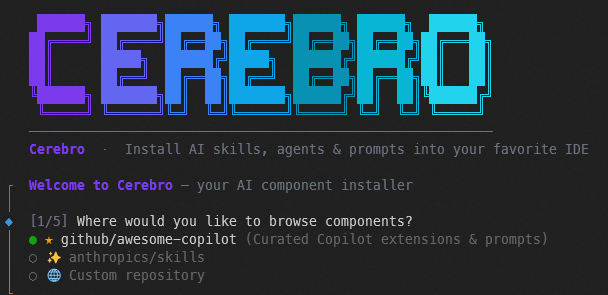

# Cerebro


A suite of tools for discovering and installing AI components — skills, agents, prompts, and instructions — from GitHub repositories directly into your IDE.

Supports **Claude Code**, **VS Code** (Copilot), **OpenCode**, and **Copilot CLI** across Windows, macOS, and Linux.

---

## What's in this repository

| Folder | Description |
|---|---|
| [`cerebro-cli/`](cerebro-cli/) | The Cerebro CLI application — browse and install AI components from your terminal |
| [`docs/`](docs/) | Repository-wide documentation: requirements, specifications, and design notes |

---

## Quick Start

**Requirements**: Node.js 18+

```bash
# Run directly with npx (no install needed)
npx cerebro

# Or install globally
npm install -g .
cerebro
```

Set `GITHUB_TOKEN` to avoid rate limits when browsing large repositories:

```bash
export GITHUB_TOKEN=ghp_your_token_here
```

---

## Cerebro CLI — Overview

The CLI lets you browse any public GitHub repository for AI components and install them with a single command.

### Interactive Mode (default)

```bash
cerebro
```

Walks you through selecting a repository, browsing components by type, choosing your target IDE, and picking a scope — all in a guided terminal UI.



### Browse & Install

```bash
# Browse default repositories
cerebro browse

# Browse a specific repo
cerebro browse anthropics/skills

# Install by name
cerebro install brand-guidelines

# Specify repo, target, and scope
cerebro install pdf --repo anthropics/skills --target claude-code --scope user

# Preview without writing files
cerebro install frontend-design --dry-run
```

### Supported IDE Targets

| IDE | Flag | Scope: User | Scope: Workspace |
|---|---|---|---|
| Claude Code | `claude-code` | `~/.claude/` | `.claude/` |
| VS Code | `vscode` | OS config dir¹ | `.vscode/` |
| OpenCode | `opencode` | OS config dir¹ | `.opencode/` |
| Copilot CLI | `copilot` | `~/.copilot/` | `.github/` |

¹ Windows: `%APPDATA%`, macOS: `~/Library/Application Support`, Linux: `~/.config`

### Default Repositories

| Repository | Contents |
|---|---|
| [`github/awesome-copilot`](https://github.com/github/awesome-copilot) | Curated Copilot extensions, agents, and prompts |
| [`anthropics/skills`](https://github.com/anthropics/skills) | Official Claude Code skills |

See [`cerebro-cli/`](cerebro-cli/) for the full CLI reference and developer documentation.

---

## Documentation

- [Requirements & Specification](docs/requirements.md)

---

## Contributing

See [`cerebro-cli/CONTRIBUTING.md`](cerebro-cli/CONTRIBUTING.md) for project setup, architecture, testing conventions, and how to add new IDE targets.

---

## License

MIT

```bash
# Use any GitHub repo
cerebro browse my-org/my-ai-components
cerebro install my-skill --repo my-org/my-ai-components --target claude-code
```

---

## Contributing

See [CONTRIBUTING.md](./CONTRIBUTING.md) for project setup, architecture, testing conventions, and how to add new IDE targets.

---

## License

MIT
