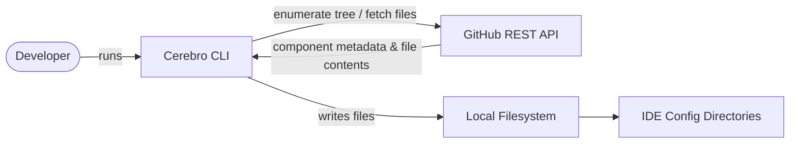

# Cerebro — Software Requirements Specification

**Version:** 0.1  
**Date:** March 2026  
**Status:** Draft

---

## 1. Introduction

### 1.1 Purpose

This document defines the functional and non-functional requirements for **Cerebro**, a cross-platform CLI tool that discovers and installs AI components from public GitHub repositories into developer IDEs.

### 1.2 Scope

Cerebro operates as a standalone Node.js CLI application. It communicates with the GitHub REST API to enumerate repository contents, and writes files to the local filesystem under IDE-specific directories. No server-side component exists; all logic runs on the user's machine.

### 1.3 Intended Audience

- Contributors adding new features or target IDE support
- Maintainers reviewing architecture decisions
- Automated agents (AI coding assistants) working within this repository

### 1.4 Definitions

| Term | Meaning |
|---|---|
| **Component** | A discrete, installable AI artefact: skill, agent, prompt, instruction, snippet, or workflow |
| **Target IDE** | The IDE into which a component is installed: Claude Code, VS Code, OpenCode, or Copilot CLI |
| **Scope** | Where a component is installed: `user` (global) or `workspace` (project-local) |
| **Catalog** | A `cerebro-catalog.yaml` file at a repo's root that explicitly declares its artifacts |
| **Heuristic discovery** | Fallback component detection based on directory layout and filename patterns |
| **Dry-run** | A preview mode that computes install paths without writing any files |

---

## 2. Product Overview

Cerebro enables developers to browse AI component repositories on GitHub and install those components into their IDE configuration directories with a single command. The tool supports an interactive terminal UI for guided use and a non-interactive CLI for scripting and automation.

### 2.1 Product Context



### 2.2 User Classes

| User | Description |
|---|---|
| **Interactive user** | Runs `cerebro` with no arguments; navigates the guided TUI wizard |
| **CLI user** | Runs `cerebro browse` / `cerebro install` in scripts or pipelines |
| **Repository author** | Publishes a `cerebro-catalog.yaml` so their repo is fully and precisely discoverable |

---

## 3. Functional Requirements

### 3.1 Component Types

The system MUST recognise and correctly classify the following component types:

| Type | Description |
|---|---|
| `skill` | Claude Code skills (`SKILL.md` + supporting files) |
| `agent` | Custom AI agents with defined personas and tool configurations |
| `prompt` | Reusable prompt templates |
| `instruction` | IDE-level behavioural instructions (e.g. `CLAUDE.md`, `copilot-instructions.md`) |
| `snippet` | Code snippets for text editors |
| `workflow` | Multi-step automated workflows |
| `unknown` | Unrecognised type; still installable |

### 3.2 Target IDEs

The system MUST support installation into four IDE targets:

| Target ID | Display name | User scope base path | Workspace scope base path |
|---|---|---|---|
| `claude-code` | Claude Code | `~/.claude/` | `.claude/` |
| `vscode` | VS Code | OS config dir¹ / `Code/User/` | `.vscode/` |
| `opencode` | OpenCode | `~/.opencode/` | `.opencode/` |
| `copilot` | Copilot CLI | `~/.copilot/` | `.github/` |

¹ Windows: `%APPDATA%`, macOS: `~/Library/Application Support`, Linux: `$XDG_CONFIG_HOME` or `~/.config`.

### 3.3 Installation Scopes

The system MUST support two scopes per install:

- **`user`** — installs into the user's global IDE config directory (applies across all projects).
- **`workspace`** — installs into the nearest ancestor directory containing a `.git` folder, or `process.cwd()` if no `.git` is found.

### 3.4 Component Discovery

#### 3.4.1 Catalog-based discovery (primary)

- The system MUST attempt to fetch and validate `cerebro-catalog.yaml` (fallback: `cerebro-catalog.yml`) from the root of a GitHub repository before performing heuristic discovery.
- The catalog MUST be validated using `validateCatalog()` from `@cowboylogic/cerebro-schema`.
- If the catalog is absent (HTTP 404), fails to parse, or contains zero valid artifacts after validation, the system MUST fall back to heuristic discovery.
- A non-404 fetch error MUST propagate as an error; it MUST NOT silently trigger the heuristic fallback.

#### 3.4.2 Heuristic discovery (fallback)

The system MUST apply two passes over the repository file tree:

**Pass 1 — Directory-marker patterns**  
When one of the following files is found in a directory, the entire directory is treated as one component:

| Filename | Detected type | Compatible targets |
|---|---|---|
| `SKILL.md` | `skill` | `claude-code` |
| `CLAUDE.md` / `claude.md` | `instruction` | `claude-code` |
| `agent.md` / `agent.yaml` / `agent.yml` | `agent` | `claude-code`, `opencode`, `copilot` |
| `prompt.md` | `prompt` | `claude-code`, `opencode`, `vscode`, `copilot` |
| `instructions.md` | `instruction` | `claude-code`, `opencode`, `vscode`, `copilot` |
| `copilot-instructions.md` | `instruction` | `copilot` |

**Pass 2 — Flat collection directories**  
Files that live exactly one level deep inside one of the following directories are each treated as one component (deeper nesting is handled by Pass 1):

| Directory | Component type |
|---|---|
| `skills/` | `skill` |
| `agents/` | `agent` |
| `prompts/` | `prompt` |
| `instructions/` | `instruction` |
| `snippets/` | `snippet` |
| `workflows/` | `workflow` |

### 3.5 GitHub Integration

#### 3.5.1 API access

- The system MUST use the GitHub REST API (`api.github.com`) to enumerate repository file trees and fetch raw file contents.
- The system MUST include a `User-Agent: cerebro/1.0` header on all requests.
- The system MUST support authentication via the `GITHUB_TOKEN` environment variable (Bearer token).
- Unauthenticated requests are permitted; the system MUST function without a token (subject to GitHub rate limits: 60 requests/hour unauthenticated vs 5,000/hour authenticated).

#### 3.5.2 Branch resolution

- The system MUST first attempt to resolve the default branch as `main`.
- If `main` does not exist, the system MUST retry with `master`.
- If a branch is explicitly provided in the `RepoSource`, that branch MUST be used without fallback.

#### 3.5.3 HTTP redirects

- The system MUST follow HTTP 301 and 302 redirects transparently.

### 3.6 Default Repositories

The system MUST ship with two pre-configured default repositories:

| Repository | Purpose |
|---|---|
| `github/awesome-copilot` | Curated Copilot agents, extensions, and prompts |
| `anthropics/skills` | Official Claude Code skills |

When no repository is specified in a command, the system MUST search all default repositories.

### 3.7 Custom Repositories

- The system MUST allow users to specify any public GitHub repository as the source for `browse` and `install` operations.
- Repository addresses MUST be accepted as `owner/repo` shorthand or as full `https://github.com/owner/repo` URLs.
- The system SHOULD persist user-added repositories to `~/.config/cerebro/user-settings.json` (or platform equivalent) for reuse across sessions.
- Persisted repositories MUST be capped at **20 entries**.

### 3.8 CLI Commands

#### 3.8.1 `cerebro` (default / `cerebro interactive`)

- MUST launch the interactive TUI wizard when invoked with no subcommand.
- The wizard MUST guide the user through: repository selection → component discovery → IDE target selection → scope selection → confirmation and installation.

#### 3.8.2 `cerebro browse [repo]`

- MUST list all discoverable components from the specified repo (or default repos if none given).
- MUST accept `-t, --type <type>` to filter output to a single component type.
- MUST group output by component type and sort alphabetically within each group.
- MUST display for each component: name, description, and compatible IDE targets.

#### 3.8.3 `cerebro install <component>`

- MUST search default repositories (or a specified `--repo`) for a component matching the given name (case-insensitive substring match).
- MUST accept the following options:
  - `-r, --repo <repo>` — override the source repository.
  - `-t, --target <ide>` — target IDE (default: `claude-code`).
  - `-s, --scope <scope>` — installation scope (default: `workspace`).
  - `--dry-run` — preview install paths without writing files.
- MUST print each installed file path after a successful install.
- In dry-run mode, MUST prefix each path with `[dry-run]` and write no files.

#### 3.8.4 `cerebro targets`

- MUST display a formatted list of all supported IDE targets with their identifiers and descriptions.

#### 3.8.5 Global options

- `--debug` — MUST enable detailed debug logging to `agent-output/cerebro-debug.log` (append mode).
- `--version` — MUST print the package version.
- `--help` — MUST print usage information for the command or subcommand.

### 3.9 Target-specific Installation Behaviour

#### 3.9.1 Claude Code

| Component type | Install path (user scope) | Install path (workspace scope) |
|---|---|---|
| `skill` | `~/.claude/skills/<name>/` | `.claude/skills/<name>/` |
| `agent` | `~/.claude/agents/` | `.claude/agents/` |
| `instruction` | `~/.claude/` (as `CLAUDE.md`) | `.claude/` (as `CLAUDE.md`) |
| `prompt` | `~/.claude/` | `.claude/` |
| other | `~/.claude/<type>s/` | `.claude/<type>s/` |

#### 3.9.2 VS Code

- Instructions and prompts MUST be appended to `<root>/.github/copilot-instructions.md` (workspace scope) or `<vscodeConfigDir>/.github/copilot-instructions.md` (user scope); the file MUST NOT be overwritten if it already exists.
- Snippets MUST be written as `<installDir>/snippets/<name>.code-snippets` in valid JSON format.

#### 3.9.3 OpenCode

- Instructions MUST be written as `AGENTS.md`.
- All installed files MUST be prepended with an HTML comment: `<!-- Installed by cerebro from <owner>/<repo> -->`.

#### 3.9.4 Copilot CLI

- Instructions and prompts MUST be appended to `copilot-instructions.md` (workspace: `<root>/.github/`, user: `~/.github/`).
- Agents MUST be written to `agents/<name>.md`.
- A separator comment `<!-- <name> - installed by cerebro -->` MUST be inserted between content sections when appending.

### 3.10 Installed-by Header

All installed files MUST be prepended with an HTML comment identifying the source:
```
<!-- Installed by cerebro from <owner>/<repo> -->
```
(Implementation may vary per installer; OpenCode currently enforces this explicitly.)

### 3.11 Interactive TUI

- The TUI MUST be implemented as a state machine with the following steps:
  1. Repository selection (default repos + custom repos from settings)
  2. Component discovery with type filtering
  3. IDE target selection
  4. Scope selection (user / workspace)
  5. Confirmation and install
- The TUI MUST allow the user to navigate backwards to a previous step.
- The TUI MUST display a summary of installed files after completion.

### 3.12 Debug Logging

- The logger MUST be inactive by default (all calls are no-ops).
- When activated via `--debug`, the logger MUST write timestamped entries to `<cwd>/agent-output/cerebro-debug.log` in append mode.
- The logger MUST capture uncaught exceptions and unhandled promise rejections to the log file.
- Log write failures MUST be non-fatal; errors MUST be written to `stderr` only.

---

## 4. Data Requirements

### 4.1 `cerebro-catalog.yaml` Catalog Schema

```yaml
cerebro: "1"          # format version (string, required)
name: my-repo         # repository display name (string, optional)
description: "..."    # repository description (string, optional)
artifacts:            # required; at least one entry after validation
  - id: code-review                   # required; slug matching ^[a-z0-9][a-z0-9-]*[a-z0-9]$
    name: Code Review                 # required display name
    type: agent                       # required; one of the valid ArtifactType values
    description: "..."                # optional; max 200 characters
    tags: [review, quality]           # optional; each tag capped at 50 characters
    compatibility:
      - tool: claude-code             # required; one of the valid ToolId values
        scope: [workspace, global]    # required
        files:
          - source: agents/code-review.agent.md   # repo-relative path; no .. or absolute paths
            target: agents/code-review.agent.md   # install-relative path
```

Valid `type` values: `skill | agent | prompt | instruction | snippet | workflow | mcp-server | hook | other`

Valid `tool` values: `claude-code | copilot | opencode | visual-studio | intellij`

Valid `scope` values: `workspace | global`

Validation rules:
- `artifacts` MUST be a non-empty array after validation.
- Each artifact MUST have a non-empty `id` matching the slug pattern and a valid `type`.
- Each artifact MUST declare at least one `compatibility` entry with at least one file.
- `source` and `target` file paths MUST NOT be absolute or contain `..` segments.
- A catalog that yields zero valid artifacts after validation causes fallback to heuristic discovery.
- Validation is performed by `validateCatalog()` from `@cowboylogic/cerebro-schema`; do not implement local validation.

### 4.2 User Settings Schema

```jsonc
{
  "customRepos": [
    { "owner": "myorg", "repo": "my-ai-skills" }
  ]
}
```

Constraints:
- File size MUST NOT exceed 64 KB; oversized files are ignored.
- `customRepos` is capped at 20 entries (oldest entries dropped when the cap is exceeded).
- Each `owner` and `repo` value MUST pass GitHub identifier validation on load.

---

## 5. Non-Functional Requirements

### 5.1 Platform Support

- The system MUST operate correctly on **Windows**, **macOS**, and **Linux**.
- Platform-specific config directory resolution:
  - Windows: `%APPDATA%`
  - macOS: `~/Library/Application Support`
  - Linux: `$XDG_CONFIG_HOME` or `~/.config`

### 5.2 Runtime Environment

- **Node.js 18 or later** is required.
- The project MUST use ESM (`"type": "module"`), with `node:` prefixes on built-in imports.
- `tsx` is used for direct TypeScript execution in development; no compiled `dist/` directory is required at runtime.

### 5.3 Dependencies

- The production dependency count MUST be kept minimal (target: ≤15).
- No native binaries or compiled add-ons are permitted.
- The GitHub API client MUST use Node.js built-in `node:https`; no external HTTP libraries.

### 5.4 Performance

- Component discovery for a typical repository tree (< 500 files) MUST complete within 5 seconds on a standard broadband connection.
- The interactive wizard MUST feel responsive; API calls MUST be accompanied by progress spinners.

### 5.5 Test Coverage

- All code changes MUST ship with unit tests in `tests/unit/` mirroring the `src/` directory structure.
- The full test suite (`npm test`) MUST pass with all 304+ tests green before any commit is merged.
- Coverage thresholds: **75% lines/functions**, **70% branches** (enforced via `vitest --coverage`).
- `src/index.ts` and `src/ui/interactive.ts` are excluded from coverage enforcement.

---

## 6. Security Requirements

Three non-negotiable defence layers MUST be maintained for all code that touches external input, file paths, or persisted data:

### 6.1 Input Validation

- **Location:** `src/core/github.ts` → `validateGitHubIdentifiers()`
- MUST reject any `owner` or `repo` string that does not conform to GitHub's naming rules (alphanumeric characters, hyphens, and underscores; no path characters) before any network call is made.
- This validation MUST be applied to repository identifiers parsed from CLI arguments, `cerebro-catalog.yaml` content, and the settings file.

### 6.2 Name Sanitization

- **Location:** `src/core/registry.ts` → `sanitizeName()`
- MUST strip `..`, path separators (`/`, `\`), and non-printable characters from all component names derived from remote repository paths.
- Applied to all component names loaded from both manifests and heuristic discovery.

### 6.3 Path Confinement

- **Location:** `src/targets/base.ts` → `BaseInstaller.assertConfined()`
- MUST call `path.resolve()` on every computed file write target and throw an error if the resolved path escapes the install directory.
- MUST be called before **every** `fs.writeFileSync` invocation in any installer.
- New IDE targets MUST extend `BaseInstaller` and call `assertConfined()`.

### 6.4 Settings File Hardening

- File size cap: 64 KB (files exceeding this are silently ignored).
- JSON structure validation on every load.
- All loaded `owner/repo` pairs MUST be re-validated through `parseRepoUrl()`.
- Custom repo list capped at 20 entries.

### 6.5 Catalog File Hardening

- All `source` and `target` file paths in `artifacts[].compatibility[].files` MUST be validated to exclude `..` traversal and absolute paths.
- Description fields MUST be truncated to 200 characters; tags to 50 characters each.
- Catalog content MUST be validated via `validateCatalog()` from `@cowboylogic/cerebro-schema` before use.

### 6.6 General Principles

- No code MUST execute content fetched from GitHub as code (no `eval`, no dynamic imports of remote content).
- The tool MUST NOT store `GITHUB_TOKEN` to disk.

---

## 7. Constraints and Conventions

### 7.1 Code Conventions

- `const enum` is **banned**; `tsx`/esbuild does not inline `const enum` values. Use `const obj = { ... } as const` instead.
- All imports MUST use `.js` extensions (resolved to `.ts` at runtime by `tsx`).
- The CLI entry-point guard MUST use `if (!process.env.VITEST)` to prevent `program.parseAsync()` from running during tests.
- `fileURLToPath` path comparisons MUST NOT be used for entry-point detection (unreliable on Windows due to drive-letter casing).

### 7.2 New IDE Targets

Any new target installer MUST:
1. Extend `BaseInstaller` from `src/targets/base.ts`.
2. Implement `getInstallDir()`, `getTargetFileName()`, and `transformContent()`.
3. Call `BaseInstaller.assertConfined()` before every file write.
4. Be registered in `src/targets/index.ts`.
5. Ship with a full unit test file in `tests/unit/targets/`.

### 7.3 Process Architecture

- All network I/O is asynchronous (Promises).
- File writes are synchronous (`fs.writeFileSync`) within an `async` install method.
- No worker threads or child processes are used.

---

## 8. External Interface Requirements

### 8.1 GitHub REST API

| Endpoint | Purpose |
|---|---|
| `GET /repos/{owner}/{repo}/git/trees/{branch}?recursive=1` | Enumerate all files in a repository tree |
| `GET /repos/{owner}/{repo}/contents/{path}` | Fetch directory listings (fallback) |
| `GET` (raw `download_url`) | Fetch raw file content |

Rate limits:
- Unauthenticated: 60 requests/hour
- Authenticated (`GITHUB_TOKEN`): 5,000 requests/hour

### 8.2 Filesystem

Written paths are confined to the following IDE config directories (see §3.2 for full paths). No writes occur outside these directories.

### 8.3 Environment Variables

| Variable | Purpose | Required |
|---|---|---|
| `GITHUB_TOKEN` | GitHub Personal Access Token for higher rate limits | No |
| `VITEST` | Set by Vitest runner; gates `program.parseAsync()` in `src/index.ts` | Internal |
| `APPDATA` | Windows: base config directory | Platform-conditional |
| `XDG_CONFIG_HOME` | Linux: override for config directory | Optional |

---

## 9. Future Considerations

These items are out of scope for the current version but may be considered in later iterations:

- Support for private GitHub repositories (OAuth device flow or token-based auth).
- A `cerebro update` command to re-install components at their latest version.
- Component versioning and pinning.
- A `cerebro uninstall` command to remove previously installed components.
- Support for GitLab and Bitbucket as component sources.
- A published package registry (beyond relying solely on GitHub repositories).
- Component dependency resolution (one component requiring another).
